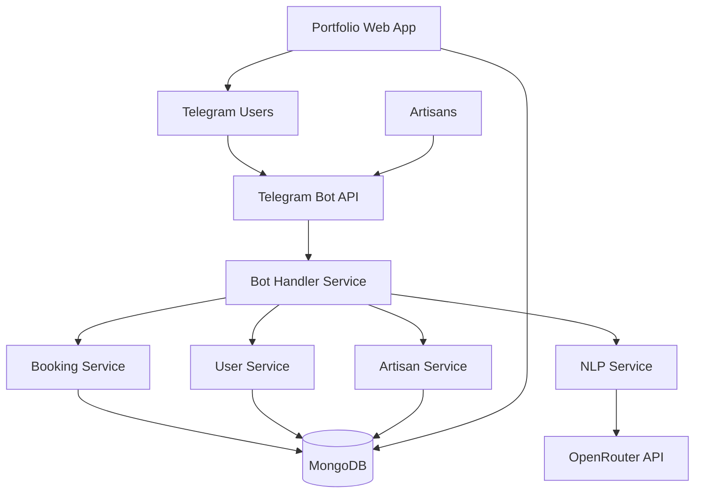

# Design Document

## Overview

The Telegram-Based Artisan Marketplace is a Node.js application that integrates Telegram Bot API, MongoDB for data persistence, and OpenRouter for LLM-powered natural language processing. The system follows a microservices-inspired architecture with clear separation between bot interface, business logic, data layer, and external integrations.

## Architecture

### High-Level Architecture



### Technology Stack

- **Runtime**: Node.js with Express.js framework
- **Database**: MongoDB with Mongoose ODM
- **Bot Interface**: Telegram Bot API using node-telegram-bot-api
- **NLP Processing**: OpenRouter API (Claude/GPT models)
- **Web Frontend**: Express.js with EJS templates for portfolio pages
- **Authentication**: Telegram user authentication
- **Deployment**: Docker containers (optional)

## Components and Interfaces

### 1. Bot Handler Service

**Purpose**: Central orchestrator for all Telegram bot interactions

**Key Methods**:
- `handleStart()`: Process /start command and show service categories
- `handleServiceSelection()`: Process category selection and prompt for description
- `handleUserMessage()`: Route natural language messages to NLP service
- `handleArtisanSelection()`: Process artisan selection and booking flow
- `handleBookingConfirmation()`: Finalize booking and send confirmations

**Dependencies**: UserService, ArtisanService, BookingService, NLPService

### 2. NLP Service

**Purpose**: Process natural language input using OpenRouter LLM API

**Key Methods**:
- `parseServiceRequest(message)`: Extract service type, urgency, location, requirements
- `generateArtisanSuggestions(parsedRequest)`: Create contextual artisan recommendations
- `classifyUserIntent(message)`: Determine user's current intent in conversation flow

**External Integration**: OpenRouter API with Claude/GPT models

**Response Format**:
```javascript
{
  serviceType: 'plumbing',
  urgency: 'high',
  location: 'Lagos Island',
  requirements: ['pipe repair', 'emergency'],
  confidence: 0.85
}
```

### 3. User Service

**Purpose**: Manage user profiles, preferences, and booking history

**Key Methods**:
- `createUser(telegramUser)`: Register new user from Telegram data
- `getUserProfile(userId)`: Retrieve user profile and preferences
- `updateUserLocation(userId, location)`: Update user's service location
- `getUserBookingHistory(userId)`: Get user's past bookings and ratings

**Data Model**: User schema with Telegram ID, location, booking history, preferences

### 4. Artisan Service

**Purpose**: Manage artisan profiles, tier evaluation, and availability

**Key Methods**:
- `registerArtisan(artisanData)`: Onboard new artisan with verification
- `evaluateArtisanTier(artisanId)`: Calculate and update artisan tier based on metrics
- `findNearbyArtisans(location, serviceType)`: Search artisans by location and service
- `updateArtisanAvailability(artisanId, schedule)`: Manage artisan calendar
- `getArtisanPortfolio(artisanId)`: Retrieve portfolio data for web display

**Tier Calculation Algorithm**:
```javascript
function calculateTier(artisan) {
  const metrics = {
    experience: artisan.yearsExperience * 10,
    projectScale: artisan.averageProjectValue * 0.1,
    successRate: artisan.completionRate * 20,
    ratings: artisan.averageRating * 15,
    portfolioQuality: artisan.portfolioScore * 10
  };
  
  const totalScore = Object.values(metrics).reduce((a, b) => a + b, 0);
  
  if (totalScore >= 80) return 'Elite';
  if (totalScore >= 50) return 'Professional';
  return 'Foundation';
}
```

### 5. Booking Service

**Purpose**: Handle booking lifecycle, scheduling, and payment coordination

**Key Methods**:
- `createBooking(userId, artisanId, serviceDetails)`: Initialize new booking
- `confirmBooking(bookingId)`: Finalize booking and send notifications
- `updateBookingStatus(bookingId, status)`: Track booking progress
- `processPayment(bookingId, paymentDetails)`: Handle bank transfer coordination
- `sendReminders(bookingId)`: Automated booking reminders

**Booking State Machine**:
```
PENDING → CONFIRMED → IN_PROGRESS → COMPLETED → PAID
    ↓         ↓            ↓           ↓
CANCELLED  CANCELLED   CANCELLED   DISPUTED
```

### 6. Portfolio Web Service

**Purpose**: Serve mobile-optimized artisan portfolio pages

**Key Features**:
- Server-side rendered pages using EJS templates
- Responsive design for mobile devices
- Deep-linking back to Telegram bot
- Image optimization and lazy loading
- SEO-friendly URLs: `/portfolio/{artisan-id}`

## Data Models

### User Schema
```javascript
{
  _id: ObjectId,
  telegramId: Number,
  firstName: String,
  lastName: String,
  username: String,
  location: {
    latitude: Number,
    longitude: Number,
    address: String
  },
  bookingHistory: [ObjectId],
  preferences: {
    serviceTypes: [String],
    maxDistance: Number,
    preferredTiers: [String]
  },
  createdAt: Date,
  updatedAt: Date
}
```

### Artisan Schema
```javascript
{
  _id: ObjectId,
  telegramId: Number,
  personalInfo: {
    firstName: String,
    lastName: String,
    phone: String,
    email: String
  },
  businessInfo: {
    businessName: String,
    serviceTypes: [String],
    yearsExperience: Number,
    certifications: [String]
  },
  location: {
    latitude: Number,
    longitude: Number,
    serviceRadius: Number,
    address: String
  },
  tier: {
    current: String, // Foundation, Professional, Elite
    score: Number,
    lastEvaluated: Date
  },
  portfolio: [{
    title: String,
    description: String,
    images: [String],
    projectScale: String,
    clientType: String,
    completedDate: Date
  }],
  metrics: {
    totalJobs: Number,
    completionRate: Number,
    averageRating: Number,
    totalEarnings: Number,
    responseTime: Number
  },
  availability: {
    schedule: Map, // day -> time slots
    isActive: Boolean
  },
  bankDetails: {
    accountName: String,
    accountNumber: String,
    bankName: String,
    routingCode: String
  },
  createdAt: Date,
  updatedAt: Date
}
```

### Booking Schema
```javascript
{
  _id: ObjectId,
  userId: ObjectId,
  artisanId: ObjectId,
  serviceDetails: {
    type: String,
    description: String,
    urgency: String,
    estimatedDuration: Number,
    estimatedCost: Number
  },
  scheduling: {
    requestedDate: Date,
    confirmedDate: Date,
    completedDate: Date
  },
  location: {
    latitude: Number,
    longitude: Number,
    address: String,
    instructions: String
  },
  status: String,
  payment: {
    method: String, // 'bank_transfer'
    amount: Number,
    currency: String,
    status: String,
    transferReference: String,
    paidAt: Date
  },
  rating: {
    score: Number,
    review: String,
    ratedAt: Date
  },
  createdAt: Date,
  updatedAt: Date
}
```

## Error Handling

### Bot Error Handling
- **Network Errors**: Retry mechanism with exponential backoff
- **Invalid User Input**: Graceful fallback to menu-driven interface
- **Service Unavailable**: Clear error messages with alternative options
- **Rate Limiting**: Queue management for high-traffic scenarios

### LLM Integration Error Handling
- **API Failures**: Fallback to rule-based parsing
- **Low Confidence Responses**: Request clarification from user
- **Timeout Errors**: Default to category-based service selection
- **Invalid Responses**: Sanitize and validate LLM outputs

### Database Error Handling
- **Connection Failures**: Connection pooling with automatic reconnection
- **Data Validation Errors**: Clear error messages to users
- **Concurrent Updates**: Optimistic locking for booking conflicts
- **Backup Strategy**: Regular automated backups with point-in-time recovery

## Testing Strategy

### Unit Testing
- **Services**: Mock external dependencies (Telegram API, OpenRouter, MongoDB)
- **Data Models**: Validate schema constraints and business rules
- **Utilities**: Test helper functions and calculations
- **Coverage Target**: 80% code coverage minimum

### Integration Testing
- **Bot Flows**: End-to-end conversation scenarios
- **Database Operations**: CRUD operations with real MongoDB instance
- **External APIs**: Test with sandbox/staging environments
- **Payment Flows**: Mock bank transfer processes

### User Acceptance Testing
- **Bot Conversations**: Test complete user journeys
- **Portfolio Pages**: Cross-device compatibility testing
- **Performance**: Load testing with concurrent users
- **Security**: Input validation and data protection testing

### Testing Tools
- **Framework**: Jest for unit and integration tests
- **Mocking**: Sinon.js for external service mocks
- **Database**: MongoDB Memory Server for isolated testing
- **Bot Testing**: Custom test harness for Telegram bot interactions

## Security Considerations

### Data Protection
- **User Privacy**: Minimal data collection, GDPR compliance
- **Telegram Security**: Validate webhook signatures
- **Database Security**: Encrypted connections, access controls
- **API Keys**: Environment variables, rotation policies

### Input Validation
- **User Messages**: Sanitize all user inputs
- **File Uploads**: Validate image uploads for portfolios
- **Location Data**: Validate coordinate ranges
- **Payment Data**: Secure handling of bank details

### Authentication & Authorization
- **Telegram Auth**: Verify user identity through Telegram
- **Artisan Verification**: Multi-step verification process
- **Admin Access**: Role-based access control
- **API Security**: Rate limiting and request validation